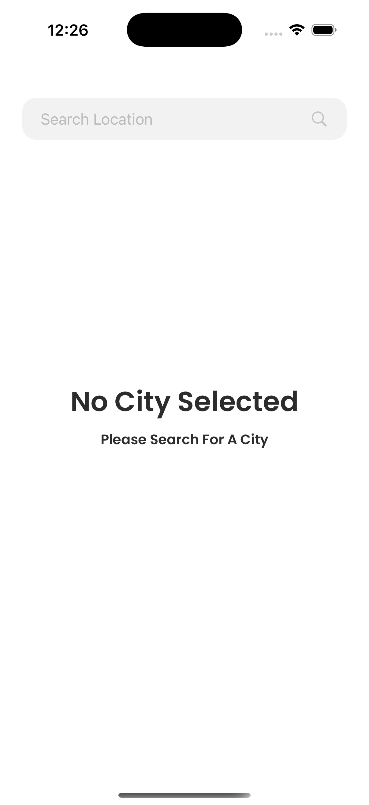

    

# Nooro Weather App

With Nooro Weather App you can:

- Search for a city and see it's temperature
- Tap to save the city
- On home screen see multiple weather information about desired city
- City is persisted across multiple launches
- Error screen for when server/connection is down or invalid query

## Tech

- [x] Swift
- [x] SwiftUI
- [x] MVVM
- [x] Tests (with XCTestCase)
- [x] Native Async Networking
- [x] Error Handling
- [x] Custom Font (Poppins)
- [x] No 3rd Party Libraries
- [x] UserDefaults Persistence

 

 
 
